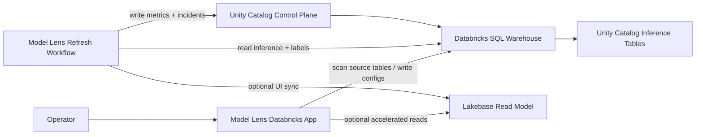

# Model Lens

Model Lens is a private, Databricks-native model observability product for customer workspaces.

It is built for teams that want an in-house alternative to external observability vendors without moving inference data out of Databricks. The product keeps monitoring state in Unity Catalog, uses a Databricks App for onboarding and investigation, and can run either warehouse-only or with Lakebase as a fast read model.

## What It Does

- onboard monitors from Unity Catalog inference tables
- map source columns into one stable monitoring contract
- compute drift, quality, and performance-contributor summaries on a refresh workflow
- persist durable monitoring state in Unity Catalog Delta tables
- optionally project hot UI state into Lakebase for fast monitor and incident views
- keep the whole stack deployable inside a customer Databricks workspace

## Product Shape

Model Lens has three layers:

1. `Warehouse system of record`
   - Unity Catalog Delta tables under `model_observability.control_plane`
   - full monitor configs, metrics, and incidents
2. `Optional Lakebase read model`
   - fast monitor-summary and incident projection for the app
   - not the source of truth
3. `Operator app + refresh workflow`
   - Databricks App for setup, onboarding, and investigation
   - serverless refresh workflow for all active monitors



## Monitoring Contract

Required mapped fields:

- `event_ts`
- `model_id`
- `prediction`

Optional mapped fields:

- `model_version`
- `prediction_proba`
- `label`
- `entity_id`

All other mapped fields become feature columns, categorical columns, or slice columns.

Current engine behavior:

- numeric features participate in drift calculations
- non-numeric selected features are kept in the contract and projected into the UI
- labels can come from the source table or an external labels table

## Deployment Modes

Model Lens now supports two deployment modes:

1. `warehouse_only`
   Use this first if you want the simplest deployment and do not have Lakebase ready yet.

2. `dev` or `prod`
   Use these when you want the Lakebase-backed fast UI path.

## Deploy Prerequisites

You need all of the following in the target Databricks workspace:

- Databricks CLI auth configured
- one SQL warehouse for Model Lens reads and writes
- serverless jobs enabled
- permissions to deploy Databricks Asset Bundles and Databricks Apps
- permissions to create/write:
  - source test tables
  - `model_observability.control_plane`
  - the target Lakebase database if using Lakebase mode

If you use Lakebase mode, the scheduled refresh job also needs to be able to connect to Lakebase. In practice, that means the job identity must be allowed to mint database credentials and connect to the target Lakebase database.

## Quick Deploy

Warehouse-only:

```bash
cd /Users/volo.vragov/Desktop/work/model-lens
python3 -m pytest

databricks bundle validate \
  -t warehouse_only \
  --var "sql_warehouse_id=<sql-warehouse-id>"

databricks bundle deploy \
  -t warehouse_only \
  --var "sql_warehouse_id=<sql-warehouse-id>"
```

Lakebase-enabled:

```bash
databricks bundle validate \
  -t dev \
  --var "sql_warehouse_id=<sql-warehouse-id>" \
  --var "lakebase_instance_name=<lakebase-instance-name>" \
  --var "lakebase_database_name=<lakebase-database-name>" \
  --var "lakebase_pguser=<lakebase-db-user>"

databricks bundle deploy \
  -t dev \
  --var "sql_warehouse_id=<sql-warehouse-id>" \
  --var "lakebase_instance_name=<lakebase-instance-name>" \
  --var "lakebase_database_name=<lakebase-database-name>" \
  --var "lakebase_pguser=<lakebase-db-user>"
```

After deploy:

1. Open the `model-lens` app.
2. Click `Setup Control Plane`.
3. Scan a source table.
4. Save a monitor.
5. Run the initial refresh.
6. Confirm the monitor summary and incidents load.

## Full Docs

- [Deployment Guide](/Users/volo.vragov/Desktop/work/model-lens/docs/DEPLOY_TO_WORKSPACE.md)
- [Architecture](/Users/volo.vragov/Desktop/work/model-lens/docs/ARCHITECTURE.md)
- [Workspace Smoke Test](/Users/volo.vragov/Desktop/work/model-lens/docs/WORKSPACE_SMOKE_TEST.md)
- [Scratch Dataset](/Users/volo.vragov/Desktop/work/model-lens/examples/scratch_dataset.sql)

## Local Commands

Run tests:

```bash
python3 -m pytest
```

Run the app locally:

```bash
PYTHONPATH=src python3 -m model_lens.app
```

Run control-plane setup:

```bash
PYTHONPATH=src python3 scripts/model_lens_setup.py --warehouse-id <sql-warehouse-id>
```

Run refresh:

```bash
PYTHONPATH=src python3 scripts/model_lens_refresh.py \
  --warehouse-id <sql-warehouse-id> \
  --use-lakebase-read-model \
  --lakebase-instance-name <lakebase-instance-name> \
  --lakebase-database-name <lakebase-database-name> \
  --lakebase-pguser <lakebase-db-user>
```

## Repo Layout

- `src/model_lens/app.py`: Databricks App UI
- `src/model_lens/services/control_plane.py`: warehouse-backed system-of-record repository with Lakebase sync hooks
- `src/model_lens/services/lakebase.py`: Lakebase connection and read-model projection
- `src/model_lens/services/refresh_engine.py`: drift, quality, and performance calculations
- `src/model_lens/workflows/refresh_job.py`: refresh workflow entrypoint
- `resources/`: Databricks bundle resources for app and job deployment

## Current Scope

Implemented now:

- warehouse-backed control plane
- optional Lakebase-backed monitor summary and incident inbox reads
- app-driven setup, onboarding, and refresh
- serverless refresh workflow
- external labels joins
- scratch data and workspace smoke test path

Still intentionally limited:

- categorical-specific drift metrics
- slice-level UI rollups
- alert delivery integrations
- full incident lifecycle with acknowledge / resolve / history

## Positioning

Model Lens is meant to be deployed into a client workspace as a product, not handed over as a notebook exercise. The codebase is structured so the durable monitoring contract lives in Unity Catalog, while the Lakebase layer only accelerates the operator experience.
