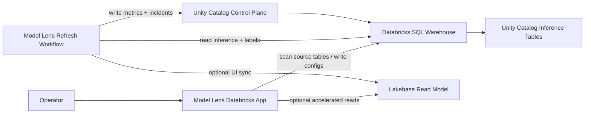

# Model Lens

Model Lens is a private, Databricks-native model observability product for customer workspaces.

It is built for teams that want an in-house alternative to external observability vendors without moving inference data out of Databricks. The product keeps monitoring state in Unity Catalog, uses a Databricks App for onboarding and investigation, and can run either warehouse-only or with Lakebase as a fast read model.

## What It Does

- onboard monitors from Unity Catalog inference tables
- map source columns into one stable monitoring contract
- backfill drift and performance history on the first refresh workflow run, then append new windows incrementally
- compute drift, quality, and performance-contributor summaries on a refresh workflow
- store per-monitor refresh cadence presets and runtime state so one shared job can service many monitors
- keep `quality_metrics` as a monitor-wide latest summary rebuilt from persisted `daily_quality_profiles`, even when incremental refreshes only touch a bounded repair range
- let operators archive a monitor from the `Monitor Settings` page without losing history, restore an archived monitor later, or permanently delete the monitor and its stored history when cleanup is required
- show recent incident lifecycle events in `Monitor Settings` so operators can inspect openings, escalations, and recoveries without leaving the current monitor context
- show an `Incidents` page with cross-monitor open incidents and recent lifecycle history, so operators can answer “what is broken right now?” without filtering one monitor at a time
- show `Refresh Diagnostics` in `Monitor Settings`, translating recent `refresh_runs` stage telemetry into bottleneck labels, trend hints, and sizing guidance during scale validation
- backfill drift, quality, and performance window history on the first refresh so timelines are populated immediately
- keep giant inference tables off the app memory hot path by using Spark-backed exact source reads for refresh computation and only bounded pandas reads for small UI drilldowns
- read Overview in bulk for large tenants by querying the latest drift and quality snapshots across all active monitors with explicit latest-row windowing instead of replaying full per-monitor history queries on page load
- keep those bulk Overview reads Databricks-SQL-safe by explicitly aliasing derived tables instead of relying on permissive parser behavior
- persist durable monitoring state in Unity Catalog Delta tables
- persist one `refresh_runs` audit row per attempted monitor execution, including skipped and failed runs
- reconcile stale `running` refresh rows automatically after a timeout so one killed worker does not wedge a monitor forever
- isolate unexpected worker failures to the affected monitor so one bad target does not fail the whole shared refresh batch
- optionally project hot UI state into Lakebase for fast monitor and incident views
- deep-link overview cards into model-specific drift investigation
- keep the whole stack deployable inside a customer Databricks workspace

## Product Shape

Model Lens has three layers:

1. `Warehouse system of record`
   - Unity Catalog Delta tables under a customer-selected `<catalog>.<schema>`
   - full monitor configs, metrics, incidents, refresh runs, and comparison windows
2. `Optional Lakebase read model`
   - fast monitor-summary and incident projection for the app
   - not the source of truth
3. `Operator app + refresh workflow`
   - Databricks App for setup, onboarding, and investigation
- one shared Spark-capable refresh workflow for all active monitors, scheduled hourly by default
- per-monitor cadence presets for drift and performance repair, stored in the control plane
- monitor-level concurrency only inside the shared workflow, capped by `MAX_PARALLEL_REFRESH_WORKERS`
- bundle-built wheel packaging for the workflow runtime



## Monitoring Contract

Required mapped fields:

- `event_ts`
- `prediction`

Optional mapped fields:

- `model_id`
- `model_version`
- `prediction_proba`
- `label`
- `entity_id`

Optional monitor-scoping fields:

- `model_id_value`
- `model_version_value`

If one source table already represents exactly one model, `model_id` can stay blank and the monitor is treated as table-scoped. If one source table contains multiple models, set `model_id` and pin `model_id_value`.

All other mapped fields become feature columns, categorical columns, or slice columns.

Current engine behavior:

- numeric features participate in drift calculations
- non-numeric selected features are kept in the contract and projected into the UI
- labels can come from the source table or an external labels table
- when you provide an external labels table, Model Lens scans it during discovery, shows schema/sample rows, prioritizes shared-name shared-type join keys, infers join/label/order columns, and reports matched vs unmatched inference rows before activation
- a 0-row join match is treated as a real review failure, not a soft hint; the UI raises a red warning so the operator can correct the join column before activation
- timestamp discovery handles both warehouse `TIMESTAMP` columns and ISO-like timestamps stored as `STRING`
- if a source table has no explicit `model_id` field but `model_version` carries identifier-like values, discovery can use that column as the monitored model scope
- if a source table truly has no model-id-like column and already represents one model, discovery now keeps that as a normal table-scoped monitor path instead of downgrading the draft just because `model_id` is absent
- an optional MLflow experiment or registered model can contribute feature ordering, model/version hints, and lineage metadata during onboarding
- discovery keeps the full numeric feature set by default; Model Lens does not silently trim the first run to a top-N subset
- the drift/performance path now avoids redundant per-feature numeric coercion during backfills so wide numeric schemas are cheaper to process than the earlier implementation
- the review step now stores per-monitor cadence presets plus per-monitor performance metrics, and the Monitor Settings page can edit those settings later without creating new Databricks jobs
- classification monitors now track `f1`, `precision`, and `recall` by default, with optional `accuracy`; regression monitors track `rmse` and `mae` by default
- the Performance page still lets the viewer switch metrics, but the dropdown is now constrained to the metric set configured for that monitor
- categorical features no longer stop at contract storage only; categorical drift now emits PSI / JS / KL rows alongside numeric drift
- performance repair now uses canonical persisted bin specs per `model_key + feature_name`, so daily performance profiles remain comparable across bootstrap and later incremental runs
- onboarding supports two baseline policies:
  - `rolling`: compare the latest `n` days with the preceding `n` days
  - `fixed`: compare a user-selected known-good baseline range with the latest window of the same length
- the first successful refresh now backfills all valid daily comparison windows for the configured baseline policy, up to the configured comparison horizon
- later refreshes run in `auto` mode by default: they append new windows when history already exists and fall back to full backfill when the stored history no longer matches the current baseline configuration
- every monitor now stores its own drift cadence, performance cadence, and runtime state so the shared hourly workflow can pick up only the monitors that are pending or overdue
- `last_label_watermark` now stores an opaque freshness signature, not just a raw timestamp; for in-source labels it includes both the latest labeled timestamp and the non-null label count inside the repair horizon so late backfills on old rows still trigger performance repair
- scheduled refreshes no longer read entire source tables into pandas by default; the shared workflow reads exact bounded source ranges with Spark, materializes daily quality/feature/performance profiles there, and derives comparison-window history from those daily profiles instead of reloading every window from the warehouse
- if an external labels table is not unique on the join key, you must provide an `External Labels Order Column`
- if a source table contains multiple `model_id` values, you must provide `Monitored Model ID Value`

## Large-Table Safeguards

Model Lens is now tuned to avoid straightforward OOM failures on very large inference tables.

Current protections:

- the shared refresh workflow now runs on Spark-capable Databricks job compute rather than a serverless Python-only environment
- scheduled refresh first reads date-range/profile metadata natively, then processes one exact bounded source range per monitor scope in Spark instead of loading raw source rows into pandas
- the workflow materializes `daily_quality_profiles`, `daily_feature_profiles`, and `daily_performance_profiles` from that Spark range and derives the persisted window/history tables from those daily profiles inside the same refresh pass
- the shared Spark workflow now defaults to serial monitor execution inside the driver even if the global worker cap is higher; that avoids running multiple large monitor Spark jobs through one shared session unless an operator deliberately overrides it
- feature deep-dive charts no longer reread the full source table when daily feature samples are available; they read sampled values from `daily_feature_profiles` first and only fall back to a bounded raw load when needed
- when a feature/detail fallback still needs raw rows, the app now loads only the latest current comparison window for prediction and dimension views instead of rereading the full baseline+current span
- raw current-window fallbacks now treat `window_end` as inclusive through the end of that calendar day, so same-day rows are not dropped when the lightweight repository path is used
- non-bootstrap refreshes now merge the current run’s daily profiles with already-persisted daily facts for the affected derivation span inside the Spark repository layer, so recomputed windows no longer depend on Python-side list merges of those daily rows
- when the Spark repository is active, the workflow also persists `comparison_windows`, `drift_metrics`, `quality_history`, `performance_metrics`, `daily_*` facts, `performance_bin_specs`, `incidents`, and `incident_history` through Spark/Delta writes instead of row-batch warehouse inserts
- numeric drift now keeps finite PSI / JS / KL values even when the current distribution moves completely outside the reference-derived range, and those histogram calculations now run in Spark from persisted daily numeric histogram edges/counts instead of flattened sample arrays
- incident open/recovered/escalated lifecycle rows for the Spark workflow are now also derived inside the Spark repository layer before persistence, so the shared refresh job no longer needs the old Python incident helper on the hot path
- the remaining Spark derivation rows now stream back to the driver with iterator-based formatting instead of collect-heavy whole-frame pulls for the main performance, drift, and quality-history packaging steps
- daily per-day feature statistics for wide monitors are now batched across numeric features and across categorical features before the per-feature distribution work, so very wide monitors no longer pay one separate stats aggregation per feature on the hot path

Relevant runtime knobs:

- `REFRESH_SAMPLE_ROWS_PER_DAY`
  default `50000`
  legacy/compatibility cap for pandas-based raw range fallbacks; no longer used by the Spark refresh workflow
- `REFRESH_MAX_ROWS_PER_WINDOW`
  default `250000`
  legacy/compatibility cap for pandas-based raw range fallbacks; no longer used by the Spark refresh workflow
- `FEATURE_DETAIL_SAMPLE_ROWS_PER_DAY`
  default `50000`
  cap rows sampled per calendar day for feature-investigation reads
- `FEATURE_DETAIL_MAX_ROWS`
  default `200000`
  hard cap for the total sampled rows loaded for feature/detail charts
- `REFRESH_STALE_RUN_MINUTES`
  default `75`
  stale-run timeout used by the shared scheduler to mark abandoned `running` rows failed before selecting new due monitors
- `MAX_PARALLEL_REFRESH_WORKERS`
  default `2`
  global cap for concurrent monitor refreshes inside the shared job; the Spark refresh repository currently clamps itself to `1` worker by default so a single Spark driver session is not shared across multiple active monitor threads

Operational guidance:

- start with the defaults
- if a customer has exceptionally wide or high-volume tables, lower the row caps before increasing compute size
- increase `MAX_PARALLEL_REFRESH_WORKERS` only after validating a dedicated Spark cluster shape for that tenant, and treat Spark-side monitor fanout as an explicit override rather than the default large-tenant mode
- for 20M-100M/day tenants, treat real Databricks Spark execution as the proof point, not the local skipped Spark tests
- the next scale step is reducing the remaining per-feature distribution/bin passes on very wide monitors and pushing even more final-row packaging/persistence behind DataFrame-native paths; the current shipping implementation already batches daily feature stats, merges persisted daily facts into Spark-backed incremental derivation for affected spans, and uses daily-feature samples in readback while the UI still reads the stable window/history tables

Discovery priorities:

- join keys: prefer shared columns that exist in both tables with the same name and compatible types, especially shared string identifiers such as `unique_hash`
- timestamps: prefer typed timestamp/date columns first, then string columns whose preview values parse like ISO timestamps
- model scope: prefer explicit `model_id`; if none exists, fall back to identifier-like `model_version` values
- labels: prefer columns named like `label`, `target`, `actual`, or `ground_truth`, with binary/categorical previews preferred for classification

## Deployment Modes

Model Lens now supports two deployment modes:

1. `warehouse_only`
   Use this first if you want the simplest deployment and do not have Lakebase ready yet.

2. `dev` or `prod`
   Use these when you want the refresh workflow to keep a Lakebase read model in sync.

Given the current Databricks CLI / provider shape (`v0.260.0`), the bundle can automatically bind the SQL warehouse to the app and workflow, but it cannot automatically attach app-level `job` or `database` resources. Model Lens therefore behaves as follows:

- the app always deploys cleanly in warehouse mode
- if Lakebase connection details are available through app environment variables or the workspace setup fields, the app switches to Lakebase-backed reads
- in warehouse-only mode, the app checks whether Lakebase instances are visible in the workspace and shows a prompt recommending Lakebase
- the `dev` / `prod` bundle targets add Lakebase parameters to the scheduled refresh workflow so it can keep the Lakebase projection current

## Deploy Prerequisites

You need all of the following in the target Databricks workspace:

- Databricks CLI auth configured
- one SQL warehouse for Model Lens reads and writes
- privileges to create and run a Spark-capable Databricks workflow job
- an approved Databricks node type for the shared refresh cluster
- permissions to deploy Databricks Asset Bundles and Databricks Apps
- permissions to write into an existing or pre-approved Unity Catalog namespace for the control plane
- enough shared-job capacity for the number of monitors you plan to keep active at once; cadence is per monitor, but the default deployment still uses one shared workflow
- optional permissions to create:
  - source test tables
  - the control-plane catalog if you want the app setup flow to create it
  - the target Lakebase database if using Lakebase mode

If you use Lakebase mode, the scheduled refresh job also needs to be able to connect to Lakebase. In practice, that means the job identity must be allowed to mint database credentials and connect to the target Lakebase database.

The default bundle/job-cluster settings for the shared refresh workflow are now:

- `refresh_spark_version`
  default `"15.4.x-scala2.12"`
- `refresh_data_security_mode`
  default `USER_ISOLATION`
- `refresh_node_type_id`
  required workspace-specific node type
- `refresh_num_workers`
  default `4`
- `refresh_timeout_seconds`
  default `14400`

For the app itself, you can enable Lakebase-backed reads in either of these ways:

- fill in `Lakebase Instance Name` and `Lakebase Database Name` in the workspace setup card after opening the app
- or pre-populate `LAKEBASE_INSTANCE_NAME` / `LAKEBASE_DATABASE_NAME` in `app.yaml` before `databricks apps deploy`

Recommended deployment model:

- pre-create the target control-plane catalog/schema with your normal platform process
- deploy Model Lens with those namespace values
- use `Create catalog if missing` only for admin-led setup in a sandbox or internal workspace
- keep the app namespace fields aligned with the bundle vars so manual app refreshes and the scheduled workflow operate on the same control plane

Current control-plane tables:

- `monitor_configs`
- `drift_metrics`
- `quality_metrics`
- `quality_history`
- `daily_quality_profiles`
- `daily_feature_profiles`
- `performance_metrics`
- `daily_performance_profiles`
- `performance_bin_specs`
- `incidents`
- `incident_history`
- `refresh_runs`
- `comparison_windows`
- `monitor_runtime_state`

Before handing this to a customer, also make sure the Databricks App service principal can:

- `CAN_USE` the SQL warehouse bound to Model Lens
- read the source data catalog/schema/tables
- read/write the control-plane catalog/schema/tables

Do not rely on the bundle's `sql_warehouse: CAN_USE` binding as the only warehouse grant. If the app is started, redeployed, or managed outside the bundle lifecycle, explicitly verify the app service principal still has `CAN_USE` on the warehouse and regrant it if needed.

Permission matrix by identity:

- Deployer or platform operator:
  deploy apps and workflows, use the chosen SQL warehouse, and provision or approve the control-plane namespace.
- Deployer or platform operator, when adding app resources manually in the Databricks Apps UI:
  `Can manage` on the app and `Can manage` on the resource being attached, such as the SQL warehouse. This is required to add or update a `sql_warehouse` app resource manually.
- App service principal:
  `CAN_USE` on the SQL warehouse; `CAN MANAGE RUN` on the refresh workflow; source data `USE CATALOG`, `USE SCHEMA`, `SELECT`; control plane `USE CATALOG`, `USE SCHEMA`, `SELECT`, `MODIFY`.
- App service principal, if Setup should create missing objects:
  `CREATE TABLE` in the control-plane schema; `CREATE SCHEMA` if the schema may not exist yet; `CREATE CATALOG` only if you want the `Create catalog if missing` toggle to work.
  If the target control-plane schema and tables are already present, Setup now checks for them first and can reuse them without `CREATE SCHEMA` / `CREATE TABLE`.
- Refresh workflow identity:
  the same warehouse, source-data, and control-plane permissions as the app, because the workflow reads source data and writes monitoring results.
- Optional MLflow-assisted onboarding:
  read access to the target experiment and/or registered model metadata.
- Optional Lakebase app reads or workflow sync:
  permission to resolve the Lakebase instance and connect to the target database; if the workflow keeps the projection fresh, it also needs write access to the target Lakebase schema.

If you delete and recreate the app while reusing the same workspace, clean up stale bundle state first:

```bash
databricks workspace delete /Workspace/Users/<your-email>/.bundle/model-lens --recursive
```

If you already have a Databricks App and want to keep its existing app compute and app service principal, use the dedicated manual walkthrough:

- [Manual Setup With An Existing Databricks App](/Users/volo.vragov/Desktop/work/model-lens/docs/MANUAL_EXISTING_APP_SETUP.md)

Important:

- if the app already exists, do not run a plain `databricks bundle deploy` against that same `app_name` unless the bundle app resource has first been bound to the existing app
- otherwise the deploy will try to create a second app and fail with an "App already exists" error
- if the operator cannot manage the app's SQL warehouse resource, do not keep retrying the bundle path; use the generated manual existing-app source path instead

## Quick Deploy

The commands below assume the default bundle variable `app_name=model-lens`.
If you override `app_name`, replace the app name in every `databricks apps ...` command and either:

- set `REFRESH_JOB_ID=<job-id>` before `databricks apps deploy`, or
- set `REFRESH_JOB_NAME=<app-name>-refresh`

Keep the checked-in `app.yaml` template environment-neutral. Set `REFRESH_JOB_ID` in the deployed app source for each workspace, but do not commit a real workspace job ID back into the repo template.
For Git-based app deployments, also replace the blank `SQL_WAREHOUSE_ID`, `CONTROL_PLANE_CATALOG`, and `CONTROL_PLANE_SCHEMA` values in the deployed `app.yaml` with the same literal workspace values you pass to the bundle or manual job creation path. Git deploys do not get the bundle-managed `sql_warehouse` binding automatically, and the shared refresh job reads its namespace from bundle variables, not from the app UI session.

If you are reusing an existing Databricks App instead of letting the bundle create one, stop here and use [Manual Setup With An Existing Databricks App](/Users/volo.vragov/Desktop/work/model-lens/docs/MANUAL_EXISTING_APP_SETUP.md). That guide now covers both:

- the bind-first bundle path when the operator can manage app resources
- the no-app-resource path that uses [prepare_existing_app_source.py](/Users/volo.vragov/Desktop/work/model-lens/scripts/prepare_existing_app_source.py) to generate a deployable source tree with a literal `SQL_WAREHOUSE_ID`
- a detailed refresh-job creation sequence, including `jobs create`, `jobs reset`, `jobs run-now`, and how to switch the app from name-based lookup to `REFRESH_JOB_ID`

The quick deploy below is for bundle-managed app creation only.

Warehouse-only:

```bash
cd /Users/volo.vragov/Desktop/work/model-lens
python3 -m pytest
python3 -m pip wheel --no-deps --no-build-isolation --wheel-dir dist .

databricks bundle validate \
  -t warehouse_only \
  --var "sql_warehouse_id=<sql-warehouse-id>" \
  --var "refresh_node_type_id=<spark-node-type-id>" \
  --var "control_plane_catalog=<control-plane-catalog>" \
  --var "control_plane_schema=<control-plane-schema>"

databricks bundle deploy \
  -t warehouse_only \
  --var "sql_warehouse_id=<sql-warehouse-id>" \
  --var "refresh_node_type_id=<spark-node-type-id>" \
  --var "control_plane_catalog=<control-plane-catalog>" \
  --var "control_plane_schema=<control-plane-schema>"

databricks apps start model-lens

databricks apps deploy model-lens \
  --source-code-path /Workspace/Users/<your-email>/.bundle/model-lens/warehouse_only/files

databricks apps get model-lens
```

Local Spark regressions now run under the normal `pytest` suite. For local execution outside Databricks, install the repo dev dependencies so `pyspark` is available; the Spark-specific tests still skip automatically when no local Java runtime is present.

Because the shared refresh workflow now runs on Spark job compute, `databricks bundle validate -t warehouse_only` also requires `refresh_node_type_id` in addition to the warehouse/catalog/schema variables.
The shared Spark cluster now defaults to `data_security_mode=USER_ISOLATION`, which is required for Unity Catalog access. If your workspace policy requires a different UC-capable mode, override `refresh_data_security_mode` to `SINGLE_USER`.
There is no longer a repo-wide default control-plane namespace in the bundle. Pass the real workspace namespace explicitly on every deploy or validate call. For example, a Hive Metastore workspace often uses:

```bash
--var "control_plane_catalog=hive_metastore" \
--var "control_plane_schema=model_lens_control_plane"
```

Then explicitly verify the app service principal still has warehouse access. The safest flow is:

```bash
databricks apps get model-lens -o json
```

Use the returned app identity to confirm `CAN_USE` on the SQL warehouse before opening the app.
If you want onboarding to accelerate the first run immediately, also verify that the same app identity has `CAN MANAGE RUN` on the refresh workflow. Without that permission, the monitor still saves and the shared scheduled job can pick it up on its next hourly run.
If `REFRESH_JOB_ID` is set, treat that as an explicit grant target and grant the app service principal `CAN_MANAGE_RUN` on that exact job ID.

The app can accelerate the first refresh asynchronously during activation. It resolves the workflow in this order:

- `REFRESH_JOB_ID` if you set it explicitly
- otherwise `REFRESH_JOB_NAME`, which defaults to `model-lens-refresh`

Those values are deploy-time app environment variables. Change them in the deployed app source `app.yaml` or in the generated manual existing-app `app.yaml`, then redeploy the app. They are not onboarding inputs inside the UI.
One shared refresh job remains the default deployment model.

For very large tenants, you can optionally split direct bootstrap/backfill triggers onto a second workflow by setting:

- `BOOTSTRAP_REFRESH_JOB_ID=<job-id>`, or
- `BOOTSTRAP_REFRESH_JOB_NAME=<job-name>`

That optional override only affects direct bootstrap/backfill triggers such as activation-time `Run First Refresh`. If it is not configured, bootstrap uses the shared refresh job by default. Scheduled pickup and readiness still depend on the main shared workflow.

The shared wheel task now uses named parameters, and the app triggers it with named overrides for `catalog`, `schema`, `scope=bootstrap`, and `model_key`, so the first refresh no longer falls back silently to the job’s hardcoded scheduler defaults when `Run now` is available.
When Setup or activation reports scheduler-only mode and `REFRESH_JOB_ID` is set, the operator fix should be explicit: grant the app service principal `CAN_MANAGE_RUN` on that job ID.
If you configure `BOOTSTRAP_REFRESH_JOB_ID`, treat that as a second explicit grant target for direct bootstrap acceleration only. Missing `CAN MANAGE RUN` on the optional bootstrap job should not block onboarding; it only removes the fast path and leaves scheduled pickup on the shared job.

The shared refresh job itself is also scheduled hourly by default in both the bundle-managed path and the generated manual existing-app path, so saved monitors are not blocked forever when `run_now` permissions are unavailable, as long as that shared workflow actually exists in the workspace.

If you deploy with a custom bundle `app_name`, set `REFRESH_JOB_NAME=<app-name>-refresh` or set `REFRESH_JOB_ID=<job-id>` before `databricks apps deploy`.
The current resolver now falls back from exact lookup to full-workspace exact, suffix, and substring matching, so Databricks Asset Bundles development names such as `[dev volo_vragov] model-lens-refresh` still resolve, but `REFRESH_JOB_ID` is still the safest option when multiple similarly named jobs exist.

Lakebase-enabled:

```bash
python3 -m pip wheel --no-deps --no-build-isolation --wheel-dir dist .

databricks bundle validate \
  -t dev \
  --var "sql_warehouse_id=<sql-warehouse-id>" \
  --var "refresh_node_type_id=<spark-node-type-id>" \
  --var "control_plane_catalog=<control-plane-catalog>" \
  --var "control_plane_schema=<control-plane-schema>" \
  --var "lakebase_instance_name=<lakebase-instance-name>" \
  --var "lakebase_database_name=<lakebase-database-name>" \
  --var "lakebase_pguser=<lakebase-db-user>"

databricks bundle deploy \
  -t dev \
  --var "sql_warehouse_id=<sql-warehouse-id>" \
  --var "refresh_node_type_id=<spark-node-type-id>" \
  --var "control_plane_catalog=<control-plane-catalog>" \
  --var "control_plane_schema=<control-plane-schema>" \
  --var "lakebase_instance_name=<lakebase-instance-name>" \
  --var "lakebase_database_name=<lakebase-database-name>" \
  --var "lakebase_pguser=<lakebase-db-user>"

databricks apps start model-lens

databricks apps deploy model-lens \
  --source-code-path /Workspace/Users/<your-email>/.bundle/model-lens/dev/files

databricks apps get model-lens
```

After deploy:

1. Open the `model-lens` app.
2. If compute is stopped, run `databricks apps start model-lens`.
3. In the `Setup` step, confirm the `Control Plane Catalog` and `Control Plane Schema` fields match your deployment target.
4. Open `Advanced workspace options` only if you want Lakebase-backed reads or need catalog creation during setup.
5. Click `Setup Control Plane`. The `Setup` step only unlocks after setup succeeds for the current namespace values. If setup fails, fix the issue and click `Setup Control Plane` again to retry. After redeploying a newer Model Lens build into an existing workspace, run `Setup Control Plane` once so additive table migrations are applied.
6. Click `Validate Workspace Wiring`.
7. Confirm the `Workspace Readiness` card shows one of these supported modes:
   - `Fully ready`: the shared workflow resolves and the app can trigger bootstrap immediately
   - `Scheduler only`: the shared workflow resolves and is scheduled, but immediate `Run now` could not be confirmed
8. Continue to `Discover`. If the readiness card stays `not ready`, onboarding remains blocked until you fix the workflow wiring.
9. In the `Discover` step, enter the inference table. Optionally add a labels table and MLflow experiment or registered model, then click `Discover`.
10. In the `Confirm` step, review the inferred display name, model key, problem type, and feature set. Use `Advanced` only if the draft needs overrides.
11. If the table contains more than one `model_id`, confirm or fill in `Monitored Model ID Value`.
12. If external labels are not unique on the join key, confirm or fill in `External Labels Order Column`.
13. Continue to `Activate`, then save the monitor.
14. Confirm the app acknowledges that the monitor was saved. If `CAN MANAGE RUN` is configured, it should also say the shared refresh job was triggered for bootstrap; otherwise the shared hourly job can pick it up on its next run only if that workflow already exists and the app is wired to it through `REFRESH_JOB_ID` or `REFRESH_JOB_NAME`.
15. If the monitor is still `pending bootstrap`, open `Monitor Settings` and use `Run First Refresh` after fixing job wiring or permissions. That retry path triggers the shared workflow again for the selected monitor only, using bootstrap scope.
16. Open `Monitor Settings` after a few runs and review `Refresh Diagnostics`. It now classifies recent runs as source-scan, daily-profile, derivation, persistence, or mixed bottlenecks, then suggests the next tuning step from the recorded timings.
16. Open the overview and analysis pages after the workflow finishes to confirm the new monitor appears and the initial refresh populated historical readback immediately.

## Full Docs

- [Deployment Guide](/Users/volo.vragov/Desktop/work/model-lens/docs/DEPLOY_TO_WORKSPACE.md)
- [Architecture](/Users/volo.vragov/Desktop/work/model-lens/docs/ARCHITECTURE.md)
- [Historical Backfill Plan](/Users/volo.vragov/Desktop/work/model-lens/docs/HISTORICAL_BACKFILL_PLAN.md)
- [Workspace Smoke Test](/Users/volo.vragov/Desktop/work/model-lens/docs/WORKSPACE_SMOKE_TEST.md)
- [Scratch Dataset](/Users/volo.vragov/Desktop/work/model-lens/examples/scratch_dataset.sql)

## Local Commands

Run tests:

```bash
python3 -m pytest
```

Build the workflow wheel artifact locally:

```bash
python3 -m pip wheel --no-deps --no-build-isolation --wheel-dir dist .
```

Run the app locally:

```bash
PYTHONPATH=src python3 -m model_lens.app
```

Run control-plane setup:

```bash
python3 scripts/model_lens_setup.py \
  --warehouse-id <sql-warehouse-id> \
  --catalog <control-plane-catalog> \
  --schema <control-plane-schema>
```

Run refresh:

```bash
python3 scripts/model_lens_refresh.py \
  --warehouse-id <sql-warehouse-id> \
  --catalog <control-plane-catalog> \
  --schema <control-plane-schema> \
  --mode auto \
  --use-lakebase-read-model true \
  --lakebase-instance-name <lakebase-instance-name> \
  --lakebase-database-name <lakebase-database-name> \
  --lakebase-pguser <lakebase-db-user>
```

## Repo Layout

- `src/model_lens/app.py`: route-based Databricks App shell
- `src/model_lens/backend.py`: frontend query layer over the control-plane repository
- `src/model_lens/callbacks.py`: global and page-specific Dash callbacks
- `src/model_lens/pages/`: overview, onboarding, drift, feature, performance, quality, and a reference page scoped to the selected monitor plus global runtime settings
- `src/model_lens/ui/`: shared styles, sidebar, components, and charts
- `src/model_lens/services/control_plane.py`: warehouse-backed system-of-record repository with Lakebase sync hooks
- `src/model_lens/services/lakebase.py`: Lakebase connection and read-model projection
- `src/model_lens/services/refresh_engine.py`: drift, quality, and performance calculations
- `src/model_lens/workflows/refresh_job.py`: refresh workflow entrypoint
- `app.yaml`: app runtime definition used by Databricks Apps
- `resources/`: Databricks bundle resources for app and job deployment

## Current Scope

Implemented now:

- warehouse-backed control plane
- optional Lakebase-backed monitor summary and incident inbox reads
- app-session Lakebase enablement via workspace setup fields
- modular multi-page Dash frontend with a staged onboarding wizard, shared components, and route-based navigation
- app-driven setup, onboarding, and refresh
- Spark-capable shared refresh workflow
- true labels can come either from the inference table itself or from an optional external labels table
- external labels joins with explicit dedupe support, including shared join-column reuse when the same key exists in both inference and labels tables
- hyphenated Databricks column names supported through backtick-quoted SQL identifiers
- explicit model scoping for shared inference tables
- rolling recent-window drift comparison
- scratch data and workspace smoke test path

Still intentionally limited:

- slice-level UI rollups
- alert delivery integrations
- full incident lifecycle with acknowledge / resolve / history
- the UI still reads the stable window/history tables rather than querying the daily-fact layer directly for every page

## Positioning

Model Lens is meant to be deployed into a client workspace as a product, not handed over as a notebook exercise. The codebase is structured so the durable monitoring contract lives in Unity Catalog, while the Lakebase layer only accelerates the operator experience.
