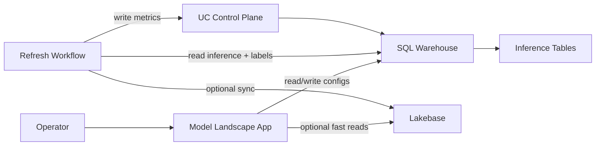

# Model Landscape

Databricks-native model observability for teams that want production ML
monitoring without moving inference data out of their workspace.

Model Landscape monitors any Unity Catalog inference table for drift,
performance degradation, data quality issues, and incidents -- with a
Databricks App for onboarding and investigation and a shared refresh
workflow that keeps metrics current.

## Architecture



Three layers:

1. **Warehouse system of record** -- Unity Catalog Delta tables under
   `<catalog>.<schema>` for configs, metrics, incidents, and refresh state
2. **Optional Lakebase read model** -- accelerated monitor/incident views
3. **App + refresh workflow** -- Databricks App for the UI, one shared
   Spark-capable workflow for all active monitors

## App Pages

| Page | What it shows |
|------|---------------|
| **Overview** | Fleet health: monitored / healthy / warning / critical, per-monitor status cards |
| **Incidents** | Cross-monitor open incidents and recent lifecycle history |
| **Drift Analysis** | PSI/JS/KL heatmaps, timelines, top drifters, threshold editing |
| **Feature Deep Dive** | Per-feature distributions with binning controls and dimension breakdowns |
| **Performance** | F1/precision/recall timelines, drift correlation, per-bin degradation contributors |
| **Data Quality** | Volume, null rates, prediction distribution, latest-window performance snapshot |
| **Monitor Settings** | Contract review, cadence/metric editing, refresh diagnostics, lifecycle actions |
| **Onboarding** | Guided wizard: setup, discover, confirm, activate |

## Monitoring Contract

**Required:** `event_ts`, `prediction`

**Optional:** `model_id`, `model_version`, `prediction_proba`, `label`,
`entity_id`

All other mapped columns become feature, categorical, or slice columns.
Labels can come from the source table or an external labels table with
configurable join keys.

## Quick Start

### Deploy and Run the Tutorial

```bash
uv run pytest
uv build --wheel --out-dir dist

databricks bundle deploy -t warehouse_only \
  --var "sql_warehouse_id=<id>" \
  --var "refresh_node_type_id=<node-type>" \
  --var "control_plane_catalog=<catalog>" \
  --var "control_plane_schema=<schema>"

databricks apps start model-landscape
databricks apps deploy model-landscape \
  --source-code-path /Workspace/Users/<email>/.bundle/model-landscape/warehouse_only/files
```

Then open the app, run Setup, and onboard your first inference table.

To populate demo data via the bundled MLOps tutorial (generates realistic
fraud and maintenance scenarios with intentional drift):

```bash
databricks bundle run tutorial_mlops
```

See [tutorial/README.md](tutorial/README.md) for the full 5-notebook
walkthrough.

## Deployment Modes

| Target | Use case |
|--------|----------|
| `warehouse_only` | Simplest deployment, no Lakebase required |
| `dev` / `prod` | Adds Lakebase sync for faster UI reads |

For deploying into an existing app (constrained workspaces), see the
[Existing App Deployment](docs/EXISTING_APP_DEPLOYMENT.md) guide.

## Permissions

| Identity | Required grants |
|----------|----------------|
| **App SP** | `CAN_USE` warehouse; source `SELECT`; control plane `SELECT` + `MODIFY` |
| **App SP** (optional) | `CAN_MANAGE` on refresh job for in-app schedule editing |
| **Refresh job** | Same warehouse + source + control plane grants as app |
| **Deployer** | Deploy apps/workflows, provision control-plane namespace |

## Repo Layout

```
src/
  model_landscape/          # Databricks App + backend
    app.py                  # Dash app shell
    backend.py              # Query layer over control plane
    callbacks.py            # Dash callbacks
    pages/                  # Overview, drift, performance, quality, etc.
    services/               # Control plane, refresh engine, onboarding
    workflows/              # Refresh job + setup entrypoints
  mlflow_lens/              # MLflow enrichment SDK
    experiment.py           # Workspace context logging
    summary.py              # Structured run summaries
    drift.py                # Training-time drift detection
    panels.py               # Confusion matrix, ROC, feature importance
    cost.py                 # Compute cost attribution
notebooks/
  model_landscape_setup.py  # Control plane setup entrypoint
  model_landscape_refresh.py # Refresh job entrypoint
tutorial/                   # 5-notebook MLOps tutorial
resources/                  # DABs job + app definitions
tests/                      # pytest suite
docs/                       # Architecture, deployment, SDK reference
```

## Local Development

```bash
uv sync --all-extras          # Install all dependencies
uv run pytest                 # Run tests
uv build --wheel --out-dir dist  # Build wheel
PYTHONPATH=src uv run python -m model_landscape.app  # Run app locally
```

## Documentation

| Document | Purpose |
|----------|---------|
| [Architecture](docs/ARCHITECTURE.md) | System design, data flow, table inventory |
| [Deployment Guide](docs/DEPLOY_TO_WORKSPACE.md) | Step-by-step bundle deployment |
| [Existing App Deployment](docs/EXISTING_APP_DEPLOYMENT.md) | Deploy into a pre-existing Databricks App |
| [MLflow Lens SDK](docs/MLFLOW_LENS_SDK.md) | SDK modules and artifact layout |
| [Workspace Smoke Test](docs/WORKSPACE_SMOKE_TEST.md) | QA/release validation checklist |
| [Tutorial](tutorial/README.md) | End-to-end MLOps tutorial (5 notebooks) |
| [Intro Deck](docs/intro-deck.html) | Customer-facing slide deck |

## Current Scope

**Implemented:** Warehouse-backed control plane, optional Lakebase reads,
multi-page Dash app with onboarding wizard, Spark-capable shared refresh
workflow, external labels with join/dedupe support, rolling and fixed
baseline policies, binary classification and regression monitoring,
categorical drift, incident lifecycle, per-monitor cadence scheduling.

**Intentionally limited:** Slice-level UI rollups, alert delivery
integrations, full incident acknowledge/resolve workflow.
