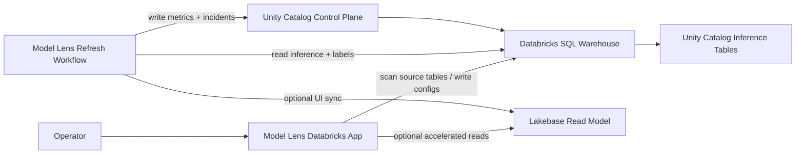

# Model Lens

Model Lens is a private, Databricks-native model observability product for customer workspaces.

It is built for teams that want an in-house alternative to external observability vendors without moving inference data out of Databricks. The product keeps monitoring state in Unity Catalog, uses a Databricks App for onboarding and investigation, and can run either warehouse-only or with Lakebase as a fast read model.

## What It Does

- onboard monitors from Unity Catalog inference tables
- map source columns into one stable monitoring contract
- compute drift, quality, and performance-contributor summaries on a refresh workflow
- persist durable monitoring state in Unity Catalog Delta tables
- optionally project hot UI state into Lakebase for fast monitor and incident views
- deep-link overview cards into model-specific drift investigation
- keep the whole stack deployable inside a customer Databricks workspace

## Product Shape

Model Lens has three layers:

1. `Warehouse system of record`
   - Unity Catalog Delta tables under a customer-selected `<catalog>.<schema>`
   - full monitor configs, metrics, and incidents
2. `Optional Lakebase read model`
   - fast monitor-summary and incident projection for the app
   - not the source of truth
3. `Operator app + refresh workflow`
   - Databricks App for setup, onboarding, and investigation
   - serverless refresh workflow for all active monitors
   - bundle-built wheel packaging for the workflow runtime



## Monitoring Contract

Required mapped fields:

- `event_ts`
- `model_id`
- `prediction`

Optional mapped fields:

- `model_version`
- `prediction_proba`
- `label`
- `entity_id`

Optional monitor-scoping fields:

- `model_id_value`
- `model_version_value`

All other mapped fields become feature columns, categorical columns, or slice columns.

Current engine behavior:

- numeric features participate in drift calculations
- non-numeric selected features are kept in the contract and projected into the UI
- labels can come from the source table or an external labels table
- an optional MLflow experiment or registered model can contribute feature ordering, model/version hints, and lineage metadata during onboarding
- refresh compares the latest `n` days with the preceding `n` days
- if an external labels table is not unique on the join key, you must provide an `External Labels Order Column`
- if a source table contains multiple `model_id` values, you must provide `Monitored Model ID Value`

## Deployment Modes

Model Lens now supports two deployment modes:

1. `warehouse_only`
   Use this first if you want the simplest deployment and do not have Lakebase ready yet.

2. `dev` or `prod`
   Use these when you want the refresh workflow to keep a Lakebase read model in sync.

Given the current Databricks CLI / provider shape (`v0.260.0`), the bundle can automatically bind the SQL warehouse to the app and workflow, but it cannot automatically attach app-level `job` or `database` resources. Model Lens therefore behaves as follows:

- the app always deploys cleanly in warehouse mode
- if Lakebase connection details are available through app environment variables or the workspace setup fields, the app switches to Lakebase-backed reads
- in warehouse-only mode, the app checks whether Lakebase instances are visible in the workspace and shows a prompt recommending Lakebase
- the `dev` / `prod` bundle targets add Lakebase parameters to the scheduled refresh workflow so it can keep the Lakebase projection current

## Deploy Prerequisites

You need all of the following in the target Databricks workspace:

- Databricks CLI auth configured
- one SQL warehouse for Model Lens reads and writes
- serverless jobs enabled
- permissions to deploy Databricks Asset Bundles and Databricks Apps
- permissions to write into an existing or pre-approved Unity Catalog namespace for the control plane
- optional permissions to create:
  - source test tables
  - the control-plane catalog if you want the app setup flow to create it
  - the target Lakebase database if using Lakebase mode

If you use Lakebase mode, the scheduled refresh job also needs to be able to connect to Lakebase. In practice, that means the job identity must be allowed to mint database credentials and connect to the target Lakebase database.

For the app itself, you can enable Lakebase-backed reads in either of these ways:

- fill in `Lakebase Instance Name` and `Lakebase Database Name` in the workspace setup card after opening the app
- or pre-populate `LAKEBASE_INSTANCE_NAME` / `LAKEBASE_DATABASE_NAME` in `app.yaml` before `databricks apps deploy`

Recommended deployment model:

- pre-create the target control-plane catalog/schema with your normal platform process
- deploy Model Lens with those namespace values
- use `Create catalog if missing` only for admin-led setup in a sandbox or internal workspace
- keep the app namespace fields aligned with the bundle vars so manual app refreshes and the scheduled workflow operate on the same control plane

Before handing this to a customer, also make sure the Databricks App service principal can:

- `CAN_USE` the SQL warehouse bound to Model Lens
- read the source data catalog/schema/tables
- read/write the control-plane catalog/schema/tables

If you delete and recreate the app while reusing the same workspace, clean up stale bundle state first:

```bash
databricks workspace delete /Workspace/Users/<your-email>/.bundle/model-lens --recursive
```

## Quick Deploy

Warehouse-only:

```bash
cd /Users/volo.vragov/Desktop/work/model-lens
python3 -m pytest
python3 -m pip wheel --no-deps --no-build-isolation --wheel-dir dist .

databricks bundle validate \
  -t warehouse_only \
  --var "sql_warehouse_id=<sql-warehouse-id>" \
  --var "control_plane_catalog=<control-plane-catalog>" \
  --var "control_plane_schema=<control-plane-schema>"

databricks bundle deploy \
  -t warehouse_only \
  --var "sql_warehouse_id=<sql-warehouse-id>" \
  --var "control_plane_catalog=<control-plane-catalog>" \
  --var "control_plane_schema=<control-plane-schema>"

databricks apps start model-lens

databricks apps deploy model-lens \
  --source-code-path /Workspace/Users/<your-email>/.bundle/model-lens/warehouse_only/files

databricks apps get model-lens
```

Lakebase-enabled:

```bash
python3 -m pip wheel --no-deps --no-build-isolation --wheel-dir dist .

databricks bundle validate \
  -t dev \
  --var "sql_warehouse_id=<sql-warehouse-id>" \
  --var "control_plane_catalog=<control-plane-catalog>" \
  --var "control_plane_schema=<control-plane-schema>" \
  --var "lakebase_instance_name=<lakebase-instance-name>" \
  --var "lakebase_database_name=<lakebase-database-name>" \
  --var "lakebase_pguser=<lakebase-db-user>"

databricks bundle deploy \
  -t dev \
  --var "sql_warehouse_id=<sql-warehouse-id>" \
  --var "control_plane_catalog=<control-plane-catalog>" \
  --var "control_plane_schema=<control-plane-schema>" \
  --var "lakebase_instance_name=<lakebase-instance-name>" \
  --var "lakebase_database_name=<lakebase-database-name>" \
  --var "lakebase_pguser=<lakebase-db-user>"

databricks apps start model-lens

databricks apps deploy model-lens \
  --source-code-path /Workspace/Users/<your-email>/.bundle/model-lens/dev/files

databricks apps get model-lens
```

After deploy:

1. Open the `model-lens` app.
2. If compute is stopped, run `databricks apps start model-lens`.
3. In the `Workspace` step, confirm the `Control Plane Catalog` and `Control Plane Schema` fields match your deployment target.
4. If Lakebase is available and you want faster app reads, fill in `Lakebase Instance Name` and `Lakebase Database Name`.
5. Click `Setup Control Plane`. The `Workspace` step only unlocks after setup succeeds for the current namespace values.
6. Continue to `Source`.
7. In the `Source` step, enter the inference table. Optionally add a labels table and MLflow experiment or registered model, then click `Discover`.
8. In the `Contract` step, review the inferred display name, model key, problem type, and feature set. Use `Advanced` only if the draft needs overrides.
9. If the table contains more than one `model_id`, confirm or fill in `Monitored Model ID Value`.
10. If external labels are not unique on the join key, confirm or fill in `External Labels Order Column`.
11. Continue to `Review`, then save the monitor and run the initial refresh.
12. Confirm the monitor summary and incidents load.

## Full Docs

- [Deployment Guide](/Users/volo.vragov/Desktop/work/model-lens/docs/DEPLOY_TO_WORKSPACE.md)
- [Architecture](/Users/volo.vragov/Desktop/work/model-lens/docs/ARCHITECTURE.md)
- [Workspace Smoke Test](/Users/volo.vragov/Desktop/work/model-lens/docs/WORKSPACE_SMOKE_TEST.md)
- [Scratch Dataset](/Users/volo.vragov/Desktop/work/model-lens/examples/scratch_dataset.sql)

## Local Commands

Run tests:

```bash
python3 -m pytest
```

Build the workflow wheel artifact locally:

```bash
python3 -m pip wheel --no-deps --no-build-isolation --wheel-dir dist .
```

Run the app locally:

```bash
PYTHONPATH=src python3 -m model_lens.app
```

Run control-plane setup:

```bash
python3 scripts/model_lens_setup.py \
  --warehouse-id <sql-warehouse-id> \
  --catalog <control-plane-catalog> \
  --schema <control-plane-schema>
```

Run refresh:

```bash
python3 scripts/model_lens_refresh.py \
  --warehouse-id <sql-warehouse-id> \
  --catalog <control-plane-catalog> \
  --schema <control-plane-schema> \
  --use-lakebase-read-model \
  --lakebase-instance-name <lakebase-instance-name> \
  --lakebase-database-name <lakebase-database-name> \
  --lakebase-pguser <lakebase-db-user>
```

## Repo Layout

- `src/model_lens/app.py`: route-based Databricks App shell
- `src/model_lens/backend.py`: frontend query layer over the control-plane repository
- `src/model_lens/callbacks.py`: global and page-specific Dash callbacks
- `src/model_lens/pages/`: overview, onboarding, drift, feature, performance, quality, and reference pages
- `src/model_lens/ui/`: shared styles, sidebar, components, and charts
- `src/model_lens/services/control_plane.py`: warehouse-backed system-of-record repository with Lakebase sync hooks
- `src/model_lens/services/lakebase.py`: Lakebase connection and read-model projection
- `src/model_lens/services/refresh_engine.py`: drift, quality, and performance calculations
- `src/model_lens/workflows/refresh_job.py`: refresh workflow entrypoint
- `app.yaml`: app runtime definition used by Databricks Apps
- `resources/`: Databricks bundle resources for app and job deployment

## Current Scope

Implemented now:

- warehouse-backed control plane
- optional Lakebase-backed monitor summary and incident inbox reads
- app-session Lakebase enablement via workspace setup fields
- modular multi-page Dash frontend with a staged onboarding wizard, shared components, and route-based navigation
- app-driven setup, onboarding, and refresh
- serverless refresh workflow
- external labels joins with explicit dedupe support
- explicit model scoping for shared inference tables
- rolling recent-window drift comparison
- scratch data and workspace smoke test path

Still intentionally limited:

- categorical-specific drift metrics
- slice-level UI rollups
- alert delivery integrations
- full incident lifecycle with acknowledge / resolve / history

## Positioning

Model Lens is meant to be deployed into a client workspace as a product, not handed over as a notebook exercise. The codebase is structured so the durable monitoring contract lives in Unity Catalog, while the Lakebase layer only accelerates the operator experience.
