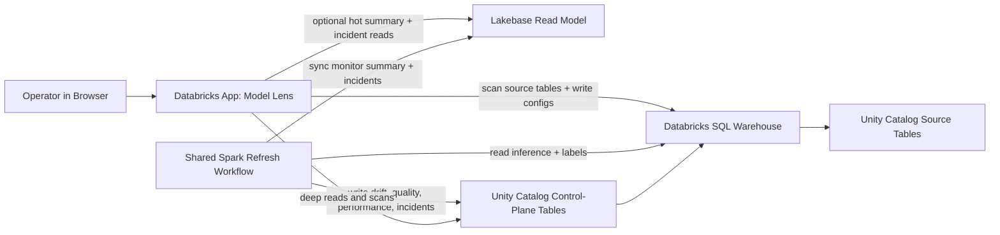

# Architecture

This document describes the deployed Model Lens architecture across both supported deployment modes.

## Design Goals

Model Lens is optimized for four things:

1. Keep customer data inside Databricks.
2. Make deployment simple enough for customer workspaces.
3. Use one monitoring contract instead of custom per-model code paths.
4. Keep monitoring state durable and auditable.
5. Keep the UI responsive without turning Lakebase into the system of record.

## Deployment Modes

Model Lens supports two runtime shapes:

1. `warehouse_only`
   - Unity Catalog + SQL warehouse only
   - no bundle-managed Lakebase resource attached to the app
   - app reads summaries and incidents directly from the warehouse-backed repository

2. `dev` / `prod` with Lakebase
   - Unity Catalog remains the system of record
   - the refresh workflow syncs a Lakebase read model for fast monitor and incident views
   - the app can use the same Lakebase read model when the operator provides Lakebase instance/database values in the session or app env

## Architecture Overview

## Components

### 1. Databricks App

The app is the operator control plane.

Responsibilities:

- provide a route-based operator shell with persistent model selection and page navigation
- let operators move from overview cards straight into model-specific drift analysis
- use a staged onboarding wizard so workspace setup, source discovery, contract review, and final activation are separated into explicit steps
- initialize the control-plane schema
- let operators override the control-plane catalog/schema used by the app session
- discover monitor drafts from source-table schema, preview rows, optional labels tables, and optional MLflow metadata
- preview external labels tables during discovery, infer join/label/order columns, and validate matched vs unmatched source rows before activation
- let operators override inferred columns only when the draft is ambiguous
- let operators choose either a rolling baseline window or a fixed known-good baseline date range
- save monitor configs
- let operators archive monitors from `Monitor Settings` by flipping them out of the active set while keeping warehouse history, or permanently delete a monitor and all of its persisted facts when needed
- let operators restore archived monitors from `Monitor Settings` without going back to manual SQL
- show recent incident lifecycle rows in `Monitor Settings` from persisted `incident_history`, so warehouse history is visible in-app even without a dedicated incident-timeline page
- show a dedicated `Incidents` page that reads cross-monitor open incidents from `incidents` and recent lifecycle rows from `incident_history`
- show `Refresh Diagnostics` in `Monitor Settings`, interpreting recent `refresh_runs` telemetry into bottleneck categories, trend guidance, and an advisory compute-footprint label
- keep the Performance page correlation-friendly by rendering the performance-metric trend above a PSI-over-time chart for the same monitor
- let the Performance page expose the tracked drift features explicitly and optionally overlay the selected drift metric's warning/critical guides on that lower drift chart
- split `Monitor Settings` into `Contract`, `Settings`, and `Admin` tabs so the contract view, editable cadence/metric controls, and lifecycle/runtime actions are separated without changing the underlying route or data model
- rank Overview severity and Drift top-feature callouts from historical max drift across persisted comparison windows instead of only the latest window
- keep Drift threshold guides optional in the page UI while leaving the shared thresholds active for status and incident semantics
- expose those same persisted threshold overrides directly on `Drift Analysis` through an inline threshold editor instead of forcing operators to leave the page for `Monitor Settings`
- keep Overview cards/counts honest by treating monitors without persisted drift rows as `Computing/Pending` rather than healthy-zero snapshots
- wrap the heavier analysis panes in loading indicators so page navigation does not look blank while warehouse queries are in flight
- trigger the initial refresh workflow asynchronously during monitor activation
- render monitor summaries and incidents from Lakebase when configured
- recommend the Lakebase-enabled target when running warehouse-only in a workspace that appears to have Lakebase available

Primary code:

- `src/model_lens/app.py`
- `src/model_lens/backend.py`
- `src/model_lens/callbacks.py`
- `src/model_lens/pages/`
- `src/model_lens/ui/`

### 2. Databricks SQL Warehouse

The SQL warehouse is the access layer for:

- source table scans
- source data reads during refresh
- writes into control-plane Delta tables
- deep drilldowns and fallback reads from the app

The warehouse is the compute access layer and the authoritative read/write path for system-of-record state.

### 3. Unity Catalog Control Plane

The durable monitoring state lives in Delta tables under a customer-selected Unity Catalog namespace:

- catalog: deployment input, no repo-wide default; pass the real workspace catalog at deploy time
- schema: deployment input, no repo-wide default; pass the real workspace schema at deploy time

Current tables:

- `monitor_configs`
- `drift_metrics`
- `quality_metrics`
- `quality_history`
- `daily_quality_profiles`
- `daily_class_quality_profiles`
- `daily_feature_profiles`
- `daily_class_feature_profiles`
- `performance_metrics`
- `daily_performance_profiles`
- `daily_label_metrics`
- `performance_bin_specs`
- `incidents`
- `incident_history`
- `refresh_runs`
- `comparison_windows`
- `monitor_runtime_state`

This is the system of record.

The app also derives a monitor-level diagnostics summary from recent `refresh_runs` rows so operators can see whether source scans, daily profile generation, derivation, or persistence are dominating the last few runs.

For binary classification monitors, the new class-aware daily tables stay additive:

- `daily_class_quality_profiles` stores per-day quality facts split by `actual` / `predicted` positive-or-negative class slices
- `daily_class_feature_profiles` stores the matching per-day feature distributions for those same slices
- `daily_label_metrics` stores raw daily `precision`, `recall`, `f1`, and `accuracy` plus the underlying class counts

Undefined classification metrics are preserved as nulls instead of being coerced to zero. That keeps Precision / Recall / F1 gaps visible on the Performance page when the metric is mathematically undefined for a given day.

Those tables are not required for the unfiltered pages. The unfiltered Drift and Data Quality views continue to read the stable window/history tables, while class-filtered views and the raw daily Performance timeline can switch to these daily facts after the next refresh populates them.

When those persisted class-aware quality facts are missing or stale, the Data Quality page can now derive filtered daily quality rows directly from source + labels for the requested class/date slice only when it can resolve a safe bounded range. That keeps class filtering usable without unbounded rescans and lets the UI distinguish a true zero-match slice from a missing-facts or unavailable-full-range condition.

`monitor_configs` now also stores the monitor's configured performance metric set and default Performance-tab metric. The persisted performance tables stay generic on `metric_name`, so refresh and readback can handle different built-in metric combinations per monitor without changing the warehouse schema again.
Monitor config writes are now atomic Delta `MERGE` operations keyed by `model_key`, so app-side saves no longer rely on a delete-then-insert gap. Monitor delete now follows the same fail-closed principle: Model Lens uses one `BEGIN ATOMIC ... END` block for all monitor-scoped deletes and refuses to run a partial cleanup sequence if that atomic path fails.

The Performance page no longer carries a second independent bin-detail chart. The per-bin impact chart remains the high-level “what hurts the metric” surface, and deeper configurable binning/outlier inspection is delegated to Feature Deep Dive through a prefilled handoff for the selected feature.

### 4. Lakebase Read Model

Lakebase is used as a projection for the app, not as the canonical store.

Current Lakebase projection tables:

- `monitor_inventory`
- `monitor_summary`
- `open_incidents`

The app uses Lakebase for hot UI reads when configured. If Lakebase is unavailable or not configured, Model Lens falls back to the warehouse-backed queries.

### 5. Refresh Workflow

The refresh workflow is a Spark-capable Databricks job.

Model Lens uses one shared refresh workflow by default. The bundle-managed workflow and the generated manual existing-app workflow payload are both scheduled hourly, so saved monitors have a default pickup path even when the app cannot call `Run now`, as long as that shared workflow already exists in the workspace and the app is wired to it through `REFRESH_JOB_ID` or `REFRESH_JOB_NAME`.

Operators can now change the shared wake interval from `Monitor Settings -> Admin` when the app identity has `CAN_MANAGE` on that shared job. That editor only changes the cron schedule on the existing shared workflow; it does not rewrite tasks, libraries, or compute settings, and it falls back to read-only status when the app can inspect but not manage the job. Only true interval cron expressions are editable there. Fixed-hour schedules remain visible but are treated as custom schedules and are preserved unchanged unless the operator explicitly selects a supported interval.

The app does not run the heavy first refresh inline. During activation it saves the monitor config, resolves the workflow from `REFRESH_JOB_ID` or `REFRESH_JOB_NAME`, and can trigger the job asynchronously so the UI stays responsive. Those are deploy-time app environment variables, not onboarding inputs. The shared refresh job now declares job-level parameters, pushes them into the wheel task's named arguments, and the app triggers `jobs/run-now` with `job_parameters`, which is the override path Databricks actually honors for this workflow. The workflow entrypoint also treats `scope=scheduler` plus a single `model_key` as `bootstrap`, so targeted single-monitor runs still land on the bootstrap path even if the caller only overrides `model_key`.

For large tenants, there is now an optional extension path for bootstrap/backfill acceleration:

- `BOOTSTRAP_REFRESH_JOB_ID`
- `BOOTSTRAP_REFRESH_JOB_NAME`

If either is set, direct bootstrap/backfill triggers use that second workflow instead of the main shared job. If neither is set, bootstrap uses the shared refresh workflow by default. This extension is intentionally non-blocking: readiness and scheduler-only operation are still anchored on the main shared workflow so low-permission workspaces do not dead-end when the optional second lane is absent.

`CAN MANAGE RUN` on the shared refresh job is therefore optional acceleration for the app service principal, while the job's Run as identity still needs the source-data and control-plane privileges required for the actual computation. If a separate bootstrap job is configured by ID, `CAN MANAGE RUN` on that second job is only required for direct bootstrap acceleration; scheduled pickup still falls back to the main shared job.

Severity thresholds are also no longer fully global. Model Lens still ships default thresholds for `psi`, `js_divergence`, `kl_divergence`, and `null_rate`, but each monitor can override them in `Monitor Settings -> Settings`. Those overrides affect Overview severity, Drift/Data Quality threshold guides, and future incident generation. Historical incident history is intentionally left unchanged so past events remain auditable under the thresholds that produced them. Invalid threshold edits now return the exact validation message to the user; they are no longer hidden behind the generic sanitized callback error.

The `Setup` step now validates more than the control-plane namespace. `Validate Workspace Wiring` computes a workspace-readiness state with three modes:

- `not_ready`: onboarding is blocked because the warehouse or shared workflow path is missing, ambiguous, paused, or unscheduled
- `scheduler_only`: the shared workflow resolves and is scheduled, so onboarding can proceed even if immediate `Run now` could not be confirmed
- `fully_ready`: the shared workflow resolves, is scheduled, and the app can confirm direct bootstrap triggering

That readiness model is intentionally strict: a monitor cannot be onboarded into a workspace that has no viable refresh path.

Responsibilities:

- enumerate active monitors
- pick only monitors that are pending bootstrap or overdue for their saved cadence preset
- prioritize one scope per model per scheduler run: `bootstrap` first, then `drift_quality`, then `performance_repair`
- process due monitors with monitor-level concurrency only, using a bounded worker pool rather than feature-level fanout
- isolate unexpected worker exceptions to per-monitor failed results so one bad target does not fail the whole shared batch
- read bounded source profiles and date ranges before refresh execution
- load one exact bounded source range per monitor scope in Spark instead of re-querying every comparison window from the warehouse
- optionally join labels from an external table with deterministic dedupe
- scope shared source tables down to one monitored model/version when configured
- backfill all valid daily rolling or fixed-baseline comparison windows on the first run
- append only new daily windows on later runs by default
- materialize daily quality, feature, and performance profiles from the Spark range load, then derive the persisted comparison-window history from those daily profiles in the same refresh pass
- for non-bootstrap runs, read the affected persisted daily facts back through the Spark repository, merge them with the current run’s daily facts there, and derive the window/history tables from that Spark-side union instead of a Python list merge
- when the Spark repository is active, persist the affected derived/fact tables back into Delta through Spark writes instead of row-batch warehouse inserts
- publish every refresh scope as a new `generation_id = run_id` only after every affected result table has been written, so both first bootstrap and later repair runs stay invisible until a complete published generation exists
- keep readers pinned to published generations only and prune each monitor back to the latest two published generations after a successful publish
- before those strict Spark writes, normalize required metadata fields such as `model_key`, `window_id`, and `computed_at` at the repository boundary so nullability-only row-contract gaps do not abort bootstrap persistence
- with the Spark repository active, numeric drift histogram aggregation and incident lifecycle derivation also stay inside the Spark refresh layer rather than dropping back to Python helpers on the hot path
- stream the final derived rows that still need Python-side packaging with iterator-based reads rather than whole-frame `collect()` calls, so the driver sees only already-aggregated outputs
- batch daily per-day feature statistics across numeric features and across categorical features before the per-feature histogram/top-N distribution passes, so wide monitors no longer pay one separate stats aggregation per feature
- record one refresh-run row per model execution with requested mode, effective mode, counts, status, and data range
- create that `refresh_runs` row before source-range discovery so every attempted monitor execution leaves an audit trail, even when validation or source inspection fails early
- record stage timings on those `refresh_runs` rows (`source_metadata_ms`, `daily_profiles_ms`, `derivation_ms`, `persistence_ms`, `total_duration_ms`) so `Monitor Settings` can classify recent bottlenecks without another warehouse-side fact table
- reconcile stale `running` refresh rows at scheduler startup after `REFRESH_STALE_RUN_MINUTES` so killed workers do not wedge monitors permanently
- persist one `monitor_runtime_state` row per monitor so the shared job can track bootstrap state, next due timestamps, and the latest error without requiring per-monitor Databricks jobs
- persist one comparison-window row per logical baseline/current pairing
- persist one quality-history row per comparison window for row-count, null-rate, and prediction-stat trends
- persist one daily-quality profile row per model/day
- persist one daily-feature profile row per model/day/feature
- persist one daily-performance profile row per model/day/feature/bin/metric
- persist one canonical performance-bin-spec row per model/feature so incremental performance repair reuses the same bucket edges as bootstrap
- persist incident lifecycle rows (`opened`, `ongoing`, `escalated`, `downgraded`, `recovered`) per comparison window while keeping `incidents` as the current open-incident projection
- replace or append persisted metric windows depending on refresh mode
- sync the current UI projection into Lakebase

Packaging/runtime shape:

- the bundle builds a wheel artifact from the repo
- the workflow still runs a `python_wheel_task`, but now on a Spark job cluster instead of a serverless environment
- the heavy source scans, joins, and daily-fact aggregation happen in Spark; the app remains warehouse/read-model based

Primary code:

- `resources/jobs.yml`
- `src/model_lens/workflows/refresh_job.py`
- `src/model_lens/services/refresh_runner.py`
- `src/model_lens/services/refresh_engine.py`

## Data Flow

### Onboarding Flow

1. The operator enters a source inference table and can optionally add a labels table plus an MLflow experiment or registered model.
2. The app loads schema metadata and sample rows through the SQL warehouse.
3. The discovery service infers the monitoring contract, feature set, slices, model scope candidates, and optional MLflow lineage. It accepts timestamp-like ISO strings, can use a true-label column directly from the inference table when one exists, prioritizes shared-name shared-type join keys for external labels, reuses that shared join column on the inference side even when no explicit `entity_id`-style column exists, and can fall back to identifier-like `model_version` values when a dedicated `model_id` column is absent.
   It now proves model/version scope from preview rows plus a bounded source sample instead of repeated unbounded `SELECT DISTINCT` scans, and it marks ambiguous scopes `requires_review` rather than escalating into a larger scan. It also treats a 0-row labels join as a review-blocking warning, preserves the full numeric feature set selected by default rather than silently shrinking the first refresh to a small subset, and persists `prediction_score_col` so binary analytics can use the correct score signal when one exists.
4. In the contract step, the operator reviews the inferred draft and only opens `Advanced` when overrides are needed.
5. If the source table contains multiple model IDs, the operator confirms or pins one `model_id_value`.
6. If the labels table is not unique on the join key, the operator confirms or provides a label ordering column.
7. In the review step, the app summarizes the final namespace, feature set, model scope, labels strategy, MLflow linkage, per-monitor cadence presets, and the selected performance metrics/default metric before activation.
8. The app writes one active row into `monitor_configs` and marks the monitor `pending` in `monitor_runtime_state`.
9. If Lakebase mode is active, the repository syncs the projected monitor inventory into Lakebase.
10. The app can immediately trigger the shared refresh job for bootstrap when `Run now` permissions are available.
11. If that trigger is unavailable, the scheduled hourly shared job still picks up the pending bootstrap automatically, but only if that shared workflow already exists and the app points at it correctly.
12. If the monitor is still pending after wiring or permission fixes, the `Monitor Settings` page exposes `Run First Refresh` to retry bootstrap for the selected monitor only.

### Refresh Flow

1. The workflow loads active monitor configs and their runtime state.
2. For each config, it reads source data from the inference table.
3. If configured, it applies `model_id_value` / `model_version_value` filters before analysis.
4. If configured, it either reads labels directly from the inference table or joins an external labels table and uses the configured order column to dedupe repeated label keys.
5. It calculates a SQL-side source profile for the refresh range so total rows, min/max dates, prediction stats, daily volume, and null-rate summaries do not require a raw full-frame load.
6. It loads one exact bounded Spark source range for that monitor scope.
7. It materializes `daily_quality_profiles`, `daily_feature_profiles`, and `daily_performance_profiles` from that Spark range.
8. For performance repair, it reuses persisted canonical bin specs so the daily performance buckets stay stable across runs.
9. It generates all valid daily comparison windows for the configured baseline policy within the comparison horizon, merges any already-persisted daily facts for the affected span, and derives drift, quality history, performance contributors, and incident lifecycle rows from that combined daily-profile layer instead of reloading each window separately.
10. It rebuilds the monitor-wide `quality_metrics` compatibility row from all persisted `daily_quality_profiles`, so Overview and Monitor Settings stay model-wide even after bounded incremental refreshes.
11. In `auto` mode, it backfills full history when no matching history exists and appends only new windows when history is already aligned.
12. It writes `refresh_runs` / `monitor_runtime_state` through the control-plane repository and writes the daily facts plus derived metric tables through the Spark repository.
13. It replaces or appends persisted rows for that model without duplicating logical windows, and recovery windows clear the open-incident projection when no incidents remain active.
14. If Lakebase mode is active, it refreshes the Lakebase monitor summary and open-incident projection.

For binary classification monitors, the same refresh pass also persists class-aware daily facts so the app can answer filtered Drift/Data Quality queries without raw rescans and can render a raw daily Performance timeline with null gaps on undefined days. The dashboard may still derive exact daily performance facts directly from source + labels, but only when it already has safe bounded window dates for that monitor view.

The current numeric drift implementation now stabilizes out-of-range current distributions by expanding the outer histogram bounds to include the current min/max while preserving the reference-derived interior bin edges. That keeps PSI / KL / JS finite for genuine severe-drift cases instead of producing divide-by-zero warnings.
With the Spark refresh repository active, those numeric-drift histograms and PSI / KL / JS aggregations now run in Spark from persisted daily numeric histogram edges/counts instead of collecting per-window sample arrays back into Python.

On the app read path, feature distributions prefer sampled values already stored in `daily_feature_profiles`. When a raw fallback is still needed for dimension or prediction detail, the app now loads only the latest current comparison window instead of the full baseline-plus-current span. That fallback also treats `window_end` as inclusive through the end of the day, so same-day rows are not accidentally dropped when the repository only exposes the unbounded `load_monitor_frame(config)` shape.

Current limitation:

- the app now has a dedicated `Incidents` page for cross-monitor open incidents and recent lifecycle history, but it is still table-first and does not yet provide acknowledgements, assignee workflow, or alert delivery
- the next scale step is reducing the remaining per-feature histogram/top-N distribution work on very wide monitors and pushing more final packaging/persistence behind DataFrame-native paths; the current shipping implementation already batches daily feature stats and uses Spark for the heavy source-range layer, but it still rebuilds that daily layer from a bounded source-range load on each affected run
- readback still centers on the stable window/history tables; only selected paths such as feature distributions and quality-history fallback currently read the daily-profile layer directly
- local `pytest` coverage is necessary but not sufficient for the Spark path, because the Spark-specific tests still skip automatically without a working local JVM; real Databricks execution remains the release gate for very large tenants
- the remaining incident readback/productization work is tracked in [Historical Backfill Plan](./HISTORICAL_BACKFILL_PLAN.md)

### Readback Flow

1. In Lakebase mode, the app reads monitor summary and incident inbox data from Lakebase.
2. In warehouse-only mode, or if Lakebase is unavailable, it reads those views from the warehouse-backed repository.
3. Overview severity and the Drift top-feature ranking are derived from historical max drift across the stored comparison windows, while `quality_metrics` remains the latest model-wide compatibility row rebuilt from daily quality facts.
4. Drift and Data Quality date-range filters are applied inclusively, and binary class filters (`actual` / `predicted`, `positive` / `negative`) read the new class-aware daily facts instead of rescanning source tables. Those heavier filter controls now apply explicitly through `Apply Drift Filters` / `Apply Quality Filters`, so changing several controls does not trigger a burst of duplicate warehouse reads. If persisted class-aware facts are missing, Data Quality can fall back to a bounded source-derived slice; otherwise the app returns a specific unavailable state instead of silently scanning the full source table.
5. Feature Deep Dive reads persisted daily-feature distributions first and only uses bounded source-window fallbacks; it no longer falls back to an unbounded raw-table scan. Custom edges and percentile clipping request exact bounded samples when they are available, and the heavier binning/outlier control changes are applied explicitly through the page's `Apply Distribution Controls` action instead of rerendering on every control default/change.
6. The Performance timeline prefers `daily_label_metrics`, so undefined daily precision / recall / F1 render as gaps instead of being implied as zeros or weighted window aggregates.
7. The app renders the current state for operators with loading indicators around the slower warehouse-backed panes.

`incidents` is intentionally the current open-incident projection. Historical openings, escalations, and recoveries are preserved separately in `incident_history`, so a model can have severe historical drift with zero current open incidents if the latest comparison window has recovered.

## Why The System Of Record Stays In Unity Catalog

Model Lens keeps the authoritative monitoring state in Unity Catalog because it is:

- durable
- auditable
- directly queryable by customer data teams
- aligned with how the refresh workflow already computes metrics

Lakebase improves interaction speed, but it is intentionally only a projection.

## Why Lakebase Exists

Model Lens uses Lakebase for the UI because the app has a different access pattern than the analytics layer.

Good Lakebase candidates:

- monitor inventory
- latest summary per model
- open incident inbox
- saved operator preferences later

Bad Lakebase candidates:

- raw inference data
- historical metric fact tables as the only durable copy
- refresh computation state

## Read/Write Split

The product now follows this split:

- `writes`: always land in Unity Catalog control-plane tables first
- `refresh compute`: always runs against the lakehouse / warehouse path
- `hot reads`: prefer Lakebase
- `fallback reads`: use the warehouse when Lakebase is missing or unavailable
- `warehouse fallback overview reads`: fetch the latest drift and quality snapshots in bulk across active monitors instead of issuing one full-history query per monitor
- `warehouse fallback overview reads`: use explicit latest-row windowing for both quality and drift snapshots, plus explicit aliases on derived quality subqueries, so the bulk Overview path stays valid in Databricks SQL and stable when the latest window has repeated writes

## Operational Notes

- The app does not perform DDL on normal reads. Control-plane creation is an explicit setup step.
- If the control-plane catalog should be created by Model Lens itself, setup must be run by an identity with catalog-create privileges.
- If Lakebase is configured for the app but unavailable at runtime, or if the projection is empty, the UI falls back to warehouse reads instead of crashing or going blank.
- The refresh workflow can also sync the Lakebase projection when it has the Lakebase instance/database inputs.
- The scheduled job identity must be permitted to connect to the target Lakebase database if you want the projection kept fresh by the workflow rather than only by app-driven refreshes.
- `last_label_watermark` is intentionally an opaque freshness signature now, not a raw timestamp contract. External labels still use the latest label-order timestamp when available; labels stored in the inference table use a `max_labeled_timestamp|label_count` signature over the repair horizon so late backfills on older rows are still detected.
- On Databricks CLI `v0.260.0`, the app resource can bind a SQL warehouse but not an app-level `database` or `job` resource. Model Lens therefore treats Lakebase app reads as session/app-env configuration instead of Terraform-managed app resource wiring.
- Existing-app deployments have two supported wiring modes:
  - bundle-managed app resource mode, where [resources/app.yml](../resources/app.yml) still grants the app `CAN_USE` on the SQL warehouse while the deployed app source carries a literal `SQL_WAREHOUSE_ID`
  - manual existing-app mode, where [prepare_existing_app_source.py](../scripts/prepare_existing_app_source.py) generates an alternate `app.yaml` with a literal `SQL_WAREHOUSE_ID` so constrained operators do not need permission to manage app resources
- `databricks bundle deploy` creates the app resource, but `databricks apps deploy ... --source-code-path ...` is still required to deploy the app source onto compute.
- `MAX_PARALLEL_REFRESH_WORKERS` is still the global cap for monitor-level concurrency inside the shared job, but the Spark refresh repository now clamps itself to serial monitor execution by default so one Spark driver session is not shared across multiple active monitor threads unless an operator explicitly opts into that tradeoff.
