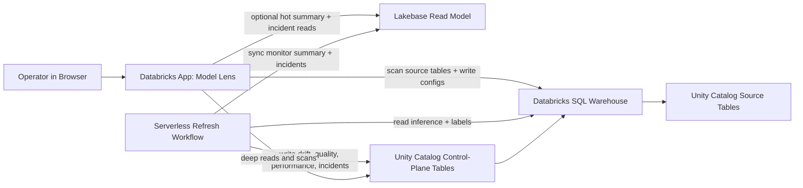

# Architecture

This document describes the deployed Model Lens architecture across both supported deployment modes.

## Design Goals

Model Lens is optimized for four things:

1. Keep customer data inside Databricks.
2. Make deployment simple enough for customer workspaces.
3. Use one monitoring contract instead of custom per-model code paths.
4. Keep monitoring state durable and auditable.
5. Keep the UI responsive without turning Lakebase into the system of record.

## Deployment Modes

Model Lens supports two runtime shapes:

1. `warehouse_only`
   - Unity Catalog + SQL warehouse only
   - no Lakebase resource attached to the app
   - app reads summaries and incidents directly from the warehouse-backed repository

2. `dev` / `prod` with Lakebase
   - Unity Catalog remains the system of record
   - Lakebase is attached as a read model for fast monitor and incident views
   - refresh workflow also syncs the Lakebase projection

## Architecture Overview

## Components

### 1. Databricks App

The app is the operator control plane.

Responsibilities:

- initialize the control-plane schema
- let operators override the control-plane catalog/schema used by the app session
- scan source tables
- map source columns into the monitoring contract
- save monitor configs
- trigger refreshes
- render monitor summaries and incidents from Lakebase when configured
- recommend the Lakebase-enabled target when running warehouse-only in a workspace that appears to have Lakebase available

Primary code:

- `src/model_lens/app.py`

### 2. Databricks SQL Warehouse

The SQL warehouse is the access layer for:

- source table scans
- source data reads during refresh
- writes into control-plane Delta tables
- deep drilldowns and fallback reads from the app

The warehouse is the compute access layer and the authoritative read/write path for system-of-record state.

### 3. Unity Catalog Control Plane

The durable monitoring state lives in Delta tables under a customer-selected Unity Catalog namespace:

- catalog: deployment input, default `model_observability`
- schema: deployment input, default `control_plane`

Current tables:

- `monitor_configs`
- `drift_metrics`
- `quality_metrics`
- `performance_metrics`
- `incidents`

This is the system of record.

### 4. Lakebase Read Model

Lakebase is used as a projection for the app, not as the canonical store.

Current Lakebase projection tables:

- `monitor_inventory`
- `monitor_summary`
- `open_incidents`

The app uses Lakebase for hot UI reads when configured. If Lakebase is unavailable or not configured, Model Lens falls back to the warehouse-backed queries.

### 5. Refresh Workflow

The refresh workflow is a serverless Databricks job.

Responsibilities:

- enumerate active monitors
- read source inference data
- optionally join labels from an external table with deterministic dedupe
- scope shared source tables down to one monitored model/version when configured
- build recent rolling baseline/current windows
- compute drift, quality, and degradation summaries
- replace the current persisted snapshot for the refreshed model
- sync the current UI projection into Lakebase

Packaging/runtime shape:

- the bundle builds a wheel artifact from the repo
- the workflow runs a `python_wheel_task`
- this avoids workspace-file import issues in Databricks serverless

Primary code:

- `resources/jobs.yml`
- `src/model_lens/workflows/refresh_job.py`
- `src/model_lens/services/refresh_runner.py`
- `src/model_lens/services/refresh_engine.py`

## Data Flow

### Onboarding Flow

1. The operator scans a source table from the app.
2. The app loads schema metadata and sample rows through the SQL warehouse.
3. The operator maps fields into the monitoring contract.
4. If the source table contains multiple model IDs, the operator pins the monitor to one `model_id_value`.
5. If the labels table is not unique on the join key, the operator provides a label ordering column.
6. The app writes one active row into `monitor_configs`.
7. If Lakebase mode is active, the repository syncs the projected monitor inventory into Lakebase.
8. The app can immediately trigger the first refresh.

### Refresh Flow

1. The workflow loads active monitor configs.
2. For each config, it reads source data from the inference table.
3. If configured, it applies `model_id_value` / `model_version_value` filters before analysis.
4. If configured, it joins an external labels table and uses the configured order column to dedupe repeated label keys.
5. It builds rolling adjacent windows from the latest `n` days and the preceding `n` days.
6. It computes numeric drift metrics, quality metrics, performance contributors, and incident rows.
7. It replaces the persisted current snapshot for that model.
8. If Lakebase mode is active, it refreshes the Lakebase monitor summary and open-incident projection.

### Readback Flow

1. In Lakebase mode, the app reads monitor summary and incident inbox data from Lakebase.
2. In warehouse-only mode, or if Lakebase is unavailable, it reads those views from the warehouse-backed repository.
3. The app renders the current state for operators.

## Why The System Of Record Stays In Unity Catalog

Model Lens keeps the authoritative monitoring state in Unity Catalog because it is:

- durable
- auditable
- directly queryable by customer data teams
- aligned with how the refresh workflow already computes metrics

Lakebase improves interaction speed, but it is intentionally only a projection.

## Why Lakebase Exists

Model Lens uses Lakebase for the UI because the app has a different access pattern than the analytics layer.

Good Lakebase candidates:

- monitor inventory
- latest summary per model
- open incident inbox
- saved operator preferences later

Bad Lakebase candidates:

- raw inference data
- historical metric fact tables as the only durable copy
- refresh computation state

## Read/Write Split

The product now follows this split:

- `writes`: always land in Unity Catalog control-plane tables first
- `refresh compute`: always runs against the lakehouse / warehouse path
- `hot reads`: prefer Lakebase
- `fallback reads`: use the warehouse when Lakebase is missing or unavailable

## Operational Notes

- The app does not perform DDL on normal reads. Control-plane creation is an explicit setup step.
- If the control-plane catalog should be created by Model Lens itself, setup must be run by an identity with catalog-create privileges.
- If Lakebase is configured for the app but unavailable at runtime, or if the projection is empty, the UI falls back to warehouse reads instead of crashing or going blank.
- The refresh workflow can also sync the Lakebase projection when it has the Lakebase instance/database inputs.
- The scheduled job identity must be permitted to connect to the target Lakebase database if you want the projection kept fresh by the workflow rather than only by app-driven refreshes.
- `databricks bundle deploy` creates the app resource, but `databricks apps deploy ... --source-code-path ...` is still required to deploy the app source onto compute.
