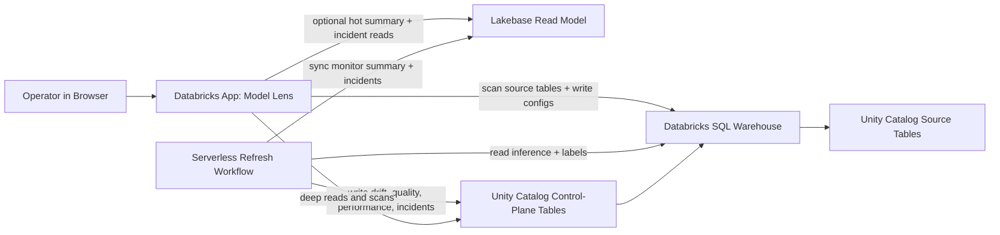

# Architecture

This document describes the deployed Model Lens architecture across both supported deployment modes.

## Design Goals

Model Lens is optimized for four things:

1. Keep customer data inside Databricks.
2. Make deployment simple enough for customer workspaces.
3. Use one monitoring contract instead of custom per-model code paths.
4. Keep monitoring state durable and auditable.
5. Keep the UI responsive without turning Lakebase into the system of record.

## Deployment Modes

Model Lens supports two runtime shapes:

1. `warehouse_only`
   - Unity Catalog + SQL warehouse only
   - no bundle-managed Lakebase resource attached to the app
   - app reads summaries and incidents directly from the warehouse-backed repository

2. `dev` / `prod` with Lakebase
   - Unity Catalog remains the system of record
   - the refresh workflow syncs a Lakebase read model for fast monitor and incident views
   - the app can use the same Lakebase read model when the operator provides Lakebase instance/database values in the session or app env

## Architecture Overview

## Components

### 1. Databricks App

The app is the operator control plane.

Responsibilities:

- provide a route-based operator shell with persistent model selection and page navigation
- let operators move from overview cards straight into model-specific drift analysis
- use a staged onboarding wizard so workspace setup, source discovery, contract review, and final activation are separated into explicit steps
- initialize the control-plane schema
- let operators override the control-plane catalog/schema used by the app session
- discover monitor drafts from source-table schema, preview rows, optional labels tables, and optional MLflow metadata
- preview external labels tables during discovery, infer join/label/order columns, and validate matched vs unmatched source rows before activation
- let operators override inferred columns only when the draft is ambiguous
- let operators choose either a rolling baseline window or a fixed known-good baseline date range
- save monitor configs
- let operators archive monitors from `Reference` by flipping them out of the active set while keeping warehouse history, or permanently delete a monitor and all of its persisted facts when needed
- let operators restore archived monitors from `Reference` without going back to manual SQL
- show recent incident lifecycle rows in `Reference` from persisted `incident_history`, so warehouse history is visible in-app even without a dedicated incident-timeline page
- trigger the initial refresh workflow asynchronously during monitor activation
- render monitor summaries and incidents from Lakebase when configured
- recommend the Lakebase-enabled target when running warehouse-only in a workspace that appears to have Lakebase available

Primary code:

- `src/model_lens/app.py`
- `src/model_lens/backend.py`
- `src/model_lens/callbacks.py`
- `src/model_lens/pages/`
- `src/model_lens/ui/`

### 2. Databricks SQL Warehouse

The SQL warehouse is the access layer for:

- source table scans
- source data reads during refresh
- writes into control-plane Delta tables
- deep drilldowns and fallback reads from the app

The warehouse is the compute access layer and the authoritative read/write path for system-of-record state.

### 3. Unity Catalog Control Plane

The durable monitoring state lives in Delta tables under a customer-selected Unity Catalog namespace:

- catalog: deployment input, default `model_observability`
- schema: deployment input, default `control_plane`

Current tables:

- `monitor_configs`
- `drift_metrics`
- `quality_metrics`
- `quality_history`
- `daily_quality_profiles`
- `daily_feature_profiles`
- `performance_metrics`
- `daily_performance_profiles`
- `performance_bin_specs`
- `incidents`
- `incident_history`
- `refresh_runs`
- `comparison_windows`
- `monitor_runtime_state`

This is the system of record.

`monitor_configs` now also stores the monitor's configured performance metric set and default Performance-tab metric. The persisted performance tables stay generic on `metric_name`, so refresh and readback can handle different built-in metric combinations per monitor without changing the warehouse schema again.

### 4. Lakebase Read Model

Lakebase is used as a projection for the app, not as the canonical store.

Current Lakebase projection tables:

- `monitor_inventory`
- `monitor_summary`
- `open_incidents`

The app uses Lakebase for hot UI reads when configured. If Lakebase is unavailable or not configured, Model Lens falls back to the warehouse-backed queries.

### 5. Refresh Workflow

The refresh workflow is a serverless Databricks job.

Model Lens uses one shared refresh workflow by default. The bundle-managed workflow and the generated manual existing-app workflow payload are both scheduled hourly, so saved monitors have a default pickup path even when the app cannot call `Run now`.

The app does not run the heavy first refresh inline. During activation it saves the monitor config, resolves the workflow from `REFRESH_JOB_ID` or `REFRESH_JOB_NAME`, and can trigger the job asynchronously so the UI stays responsive. `CAN MANAGE RUN` on the refresh job is therefore optional acceleration for the app service principal, while the job's Run as identity still needs the source-data and control-plane privileges required for the actual computation.

Responsibilities:

- enumerate active monitors
- pick only monitors that are pending bootstrap or overdue for their saved cadence preset
- prioritize one scope per model per scheduler run: `bootstrap` first, then `drift_quality`, then `performance_repair`
- process due monitors with monitor-level concurrency only, using a bounded worker pool rather than feature-level fanout
- isolate unexpected worker exceptions to per-monitor failed results so one bad target does not fail the whole shared batch
- read SQL-side source profiles for bounded refresh ranges
- load one bounded projected refresh range per monitor scope instead of re-querying every comparison window from the warehouse
- optionally join labels from an external table with deterministic dedupe
- scope shared source tables down to one monitored model/version when configured
- backfill all valid daily rolling or fixed-baseline comparison windows on the first run
- append only new daily windows on later runs by default
- enforce deterministic per-day and per-window row caps during pandas-based window analysis so very large tables do not cause simple worker OOMs
- materialize daily quality, feature, and performance profiles from the bounded range load, then derive the persisted comparison-window history from those daily profiles in the same refresh pass
- for non-bootstrap runs, merge those newly built daily profiles with already-persisted daily facts for the affected date span before deriving the window/history tables
- record one refresh-run row per model execution with requested mode, effective mode, counts, status, and data range
- create that `refresh_runs` row before source-range discovery so every attempted monitor execution leaves an audit trail, even when validation or source inspection fails early
- reconcile stale `running` refresh rows at scheduler startup after `REFRESH_STALE_RUN_MINUTES` so killed workers do not wedge monitors permanently
- persist one `monitor_runtime_state` row per monitor so the shared job can track bootstrap state, next due timestamps, and the latest error without requiring per-monitor Databricks jobs
- persist one comparison-window row per logical baseline/current pairing
- persist one quality-history row per comparison window for row-count, null-rate, and prediction-stat trends
- persist one daily-quality profile row per model/day
- persist one daily-feature profile row per model/day/feature
- persist one daily-performance profile row per model/day/feature/bin/metric
- persist one canonical performance-bin-spec row per model/feature so incremental performance repair reuses the same bucket edges as bootstrap
- persist incident lifecycle rows (`opened`, `ongoing`, `escalated`, `downgraded`, `recovered`) per comparison window while keeping `incidents` as the current open-incident projection
- replace or append persisted metric windows depending on refresh mode
- sync the current UI projection into Lakebase

Packaging/runtime shape:

- the bundle builds a wheel artifact from the repo
- the workflow runs a `python_wheel_task`
- this avoids workspace-file import issues in Databricks serverless

Primary code:

- `resources/jobs.yml`
- `src/model_lens/workflows/refresh_job.py`
- `src/model_lens/services/refresh_runner.py`
- `src/model_lens/services/refresh_engine.py`

## Data Flow

### Onboarding Flow

1. The operator enters a source inference table and can optionally add a labels table plus an MLflow experiment or registered model.
2. The app loads schema metadata and sample rows through the SQL warehouse.
3. The discovery service infers the monitoring contract, feature set, slices, model scope candidates, and optional MLflow lineage. It accepts timestamp-like ISO strings, can use a true-label column directly from the inference table when one exists, prioritizes shared-name shared-type join keys for external labels, reuses that shared join column on the inference side even when no explicit `entity_id`-style column exists, and can fall back to identifier-like `model_version` values when a dedicated `model_id` column is absent.
   It also treats a 0-row labels join as a review-blocking warning and keeps the full numeric feature set selected by default rather than silently shrinking the first refresh to a small subset.
4. In the contract step, the operator reviews the inferred draft and only opens `Advanced` when overrides are needed.
5. If the source table contains multiple model IDs, the operator confirms or pins one `model_id_value`.
6. If the labels table is not unique on the join key, the operator confirms or provides a label ordering column.
7. In the review step, the app summarizes the final namespace, feature set, model scope, labels strategy, MLflow linkage, per-monitor cadence presets, and the selected performance metrics/default metric before activation.
8. The app writes one active row into `monitor_configs` and marks the monitor `pending` in `monitor_runtime_state`.
9. If Lakebase mode is active, the repository syncs the projected monitor inventory into Lakebase.
10. The app can immediately trigger the shared refresh job for bootstrap when `Run now` permissions are available.
11. If that trigger is unavailable, the scheduled hourly shared job still picks up the pending bootstrap automatically.

### Refresh Flow

1. The workflow loads active monitor configs and their runtime state.
2. For each config, it reads source data from the inference table.
3. If configured, it applies `model_id_value` / `model_version_value` filters before analysis.
4. If configured, it either reads labels directly from the inference table or joins an external labels table and uses the configured order column to dedupe repeated label keys.
5. It calculates a SQL-side source profile for the refresh range so total rows, min/max dates, prediction stats, daily volume, and null-rate summaries do not require a raw full-frame load.
6. It loads one bounded projected refresh range for that monitor scope, using the configured sampling caps.
7. It materializes `daily_quality_profiles`, `daily_feature_profiles`, and `daily_performance_profiles` from that bounded range.
8. For performance repair, it reuses persisted canonical bin specs so the daily performance buckets stay stable across runs.
9. It generates all valid daily comparison windows for the configured baseline policy within the comparison horizon, merges any already-persisted daily facts for the affected span, and derives drift, quality history, performance contributors, and incident lifecycle rows from that combined daily-profile layer instead of reloading each window separately.
10. It rebuilds the monitor-wide `quality_metrics` compatibility row from all persisted `daily_quality_profiles`, so Overview and Reference stay model-wide even after bounded incremental refreshes.
11. In `auto` mode, it backfills full history when no matching history exists and appends only new windows when history is already aligned.
12. It writes `refresh_runs`, `comparison_windows`, and `monitor_runtime_state` updates alongside the metric facts.
13. It replaces or appends persisted rows for that model without duplicating logical windows.
14. If Lakebase mode is active, it refreshes the Lakebase monitor summary and open-incident projection.

The current numeric drift implementation now stabilizes out-of-range current distributions by expanding the outer histogram bounds to include the current min/max while preserving the reference-derived interior bin edges. That keeps PSI / KL / JS finite for genuine severe-drift cases instead of producing divide-by-zero warnings.

On the app read path, feature distributions prefer sampled values already stored in `daily_feature_profiles`. When a raw fallback is still needed for dimension or prediction detail, the app now loads only the latest current comparison window instead of the full baseline-plus-current span. That fallback also treats `window_end` as inclusive through the end of the day, so same-day rows are not accidentally dropped when the repository only exposes the unbounded `load_monitor_frame(config)` shape.

Current limitation:

- the app UI still emphasizes current/open incidents; `Reference` now shows recent incident lifecycle rows, but there is not yet a dedicated historical incident timeline page even though warehouse incident history is persisted
- the next scale step is reading already-persisted daily facts across more readback and recompute paths; the current shipping implementation already derives window tables from the per-run daily-profile layer inside refresh, but it still rebuilds that daily layer from a bounded source-range load on each affected run
- readback still centers on the stable window/history tables; only selected paths such as feature distributions and quality-history fallback currently read the daily-profile layer directly
- the remaining incident readback/productization work is tracked in [Historical Backfill Plan](/Users/volo.vragov/Desktop/work/model-lens/docs/HISTORICAL_BACKFILL_PLAN.md)

### Readback Flow

1. In Lakebase mode, the app reads monitor summary and incident inbox data from Lakebase.
2. In warehouse-only mode, or if Lakebase is unavailable, it reads those views from the warehouse-backed repository.
3. The app renders the current state for operators.

## Why The System Of Record Stays In Unity Catalog

Model Lens keeps the authoritative monitoring state in Unity Catalog because it is:

- durable
- auditable
- directly queryable by customer data teams
- aligned with how the refresh workflow already computes metrics

Lakebase improves interaction speed, but it is intentionally only a projection.

## Why Lakebase Exists

Model Lens uses Lakebase for the UI because the app has a different access pattern than the analytics layer.

Good Lakebase candidates:

- monitor inventory
- latest summary per model
- open incident inbox
- saved operator preferences later

Bad Lakebase candidates:

- raw inference data
- historical metric fact tables as the only durable copy
- refresh computation state

## Read/Write Split

The product now follows this split:

- `writes`: always land in Unity Catalog control-plane tables first
- `refresh compute`: always runs against the lakehouse / warehouse path
- `hot reads`: prefer Lakebase
- `fallback reads`: use the warehouse when Lakebase is missing or unavailable
- `warehouse fallback overview reads`: fetch the latest drift and quality snapshots in bulk across active monitors instead of issuing one full-history query per monitor
- `warehouse fallback overview reads`: use explicit latest-row windowing for both quality and drift snapshots, plus explicit aliases on derived quality subqueries, so the bulk Overview path stays valid in Databricks SQL and stable when the latest window has repeated writes

## Operational Notes

- The app does not perform DDL on normal reads. Control-plane creation is an explicit setup step.
- If the control-plane catalog should be created by Model Lens itself, setup must be run by an identity with catalog-create privileges.
- If Lakebase is configured for the app but unavailable at runtime, or if the projection is empty, the UI falls back to warehouse reads instead of crashing or going blank.
- The refresh workflow can also sync the Lakebase projection when it has the Lakebase instance/database inputs.
- The scheduled job identity must be permitted to connect to the target Lakebase database if you want the projection kept fresh by the workflow rather than only by app-driven refreshes.
- `last_label_watermark` is intentionally an opaque freshness signature now, not a raw timestamp contract. External labels still use the latest label-order timestamp when available; labels stored in the inference table use a `max_labeled_timestamp|label_count` signature over the repair horizon so late backfills on older rows are still detected.
- On Databricks CLI `v0.260.0`, the app resource can bind a SQL warehouse but not an app-level `database` or `job` resource. Model Lens therefore treats Lakebase app reads as session/app-env configuration instead of Terraform-managed app resource wiring.
- Existing-app deployments have two supported wiring modes:
  - bundle-managed app resource mode, where [app.yaml](/Users/volo.vragov/Desktop/work/model-lens/app.yaml) resolves `SQL_WAREHOUSE_ID` from `valueFrom: sql_warehouse`
  - manual existing-app mode, where [prepare_existing_app_source.py](/Users/volo.vragov/Desktop/work/model-lens/scripts/prepare_existing_app_source.py) generates an alternate `app.yaml` with a literal `SQL_WAREHOUSE_ID` so constrained operators do not need permission to manage app resources
- `databricks bundle deploy` creates the app resource, but `databricks apps deploy ... --source-code-path ...` is still required to deploy the app source onto compute.
- `MAX_PARALLEL_REFRESH_WORKERS` caps only monitor-level concurrency inside the shared job. It does not fan out feature computations, and it should be tuned alongside the row-sampling caps rather than treated as a free throughput multiplier.
